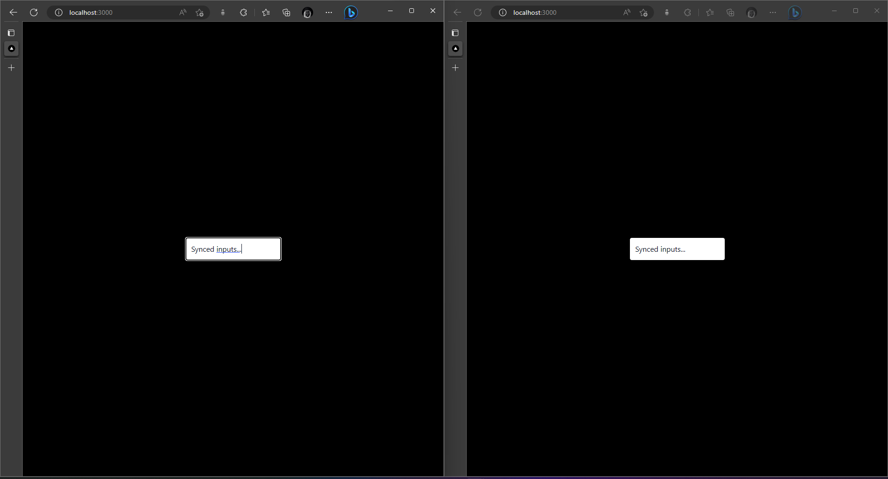

# socket

Practice repo to implement socket.io between a server and a nextjs project

## Why

In preparation for a product I'd like to build, I'd like to understand how to
use socket.io (websockets)

## Goals

- [x] Implement a nodejs server
- [x] Implement a nextjs client
- [x] Connect server and client with socket.io
- [x] Implement a multiplayer input field

## Screenshot

In the screenshot below, the two clients connected to `localhost:3000` have 
synchronized values in the input fields.

## What Next?

- During the development of this quick project, I learnt about Supabase Realtime.
That immediately seems attractive for the project I plan to work on. I'll read
more about that and see how that can fit in.
- The biggest disadvantage for me here is that I don't get to utilise NextJS's
api routes because I'd love to deploy it on Vercel.

